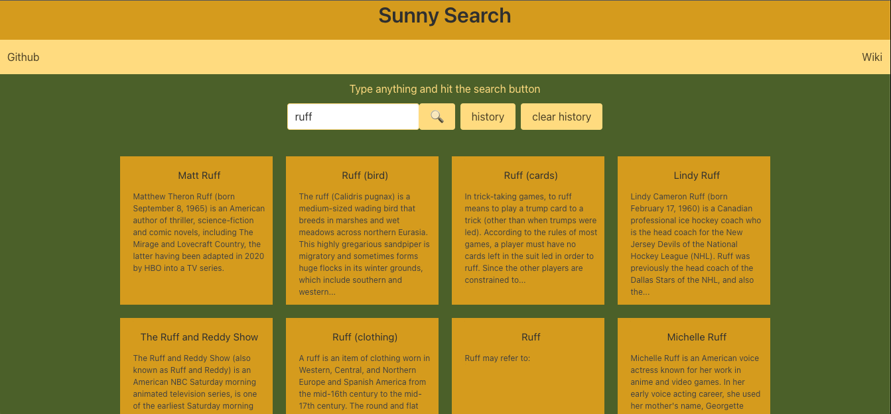
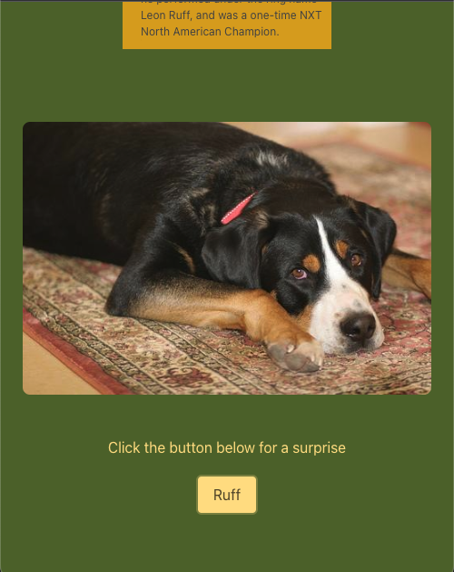

# group-project-1

## Description
Our motivation was to build an application that would allow us to practice integrating more than one API in an application, styling with Bulma, and working with local storage. We built this project so that users could research Wiki articles and alleviate cognitive fatigue. We learned about the importance of security measures in repos. During our first phase we were headed in a  different direction and had exposed an API key in a commit. We received a notification from GitGuardian and took measures to fix that issue. We pivoted and now off this ad-free application that can be used to search any articles that can be found on Wikipedia as well as can be utilized to fetch random dog pictures so users can have a chance to relieve cognitive dulling.

## Usage

   

   

   

### To use the application, click on this link:
(insert deployed app link)

Next, type in a topic of your choosing in the search bar and click the magnifying glass. You will then see a grid of boxes that contain articles related to your topic. Clicking the article text will open a new tab window and will show a Wiki page about the article title that you selected. After exploring, you can close the tab window and navigate back up to the main application page. At the bottom of the page you can view a random dog picture by clicking on the "Ruff" button. You may click as many times as you wish and will generate a random dog every time you do so. To view the history of what you have searched in the search bar, click on the "history" button next to the magnifying glass. You will then see a modal pop-up with a list of the items you have searched. You can click on the X on the right side of the modal to go back to the main page. To clear your history of searches click on the "clear history" button next to history. If you click on the "history" button after you click ont he "clear history", the modal will only contain the title "Search History" with nothing else in it. To visit where the application is located, you may click on the "Github" located to the left of the navigation bar. To visit the actual Wikipedia webiste, click on the "Wiki" that's located on the right side of the navigation bar.

## Credits

### Collaborators:
Deandra Diedrick,
Josh Deino,
Kenyon Gordon,
Paola Guerrero

### Tutorials:
https://www.youtube.com/watch?v=yqwHxAH1xrw

https://www.youtube.com/watch?v=yqwHxAH1xrw

### APIs

https://en.wikipedia.org/api/rest_v1/#/

https://dog.ceo/dog-api/

